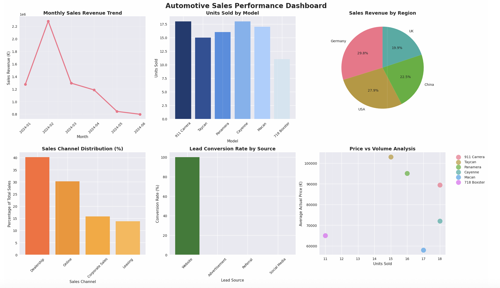

# Automotive-Sales-Analytics-Dashboard-using-PowerBI
Business Insights &amp; Strategic Analysis for automative industry 

# Business Insights & Strategic Analysis

## Executive Summary

Analysis of €7.67M in automotive sales reveals strong performance drivers and strategic opportunities. The 911 Carrera leads model performance while Germany dominates regional sales. Website-sourced leads show exceptional conversion rates, indicating digital marketing effectiveness.

## Performance Overview

### Financial Performance
- **Total Revenue**: €7,673,000 across 6 months
- **Average Deal Size**: €80,768 per transaction
- **Revenue Growth**: -37.4% monthly decline (requires attention)
- **Target Achievement**: 10-17% of regional monthly targets

### Volume Metrics
- **Total Units Sold**: 95 vehicles
- **Average Monthly Volume**: 16 units
- **Peak Month**: February (28 units, €2.28M)
- **Conversion Rate**: 33.3% from leads to sales

## Model Performance Analysis

### Revenue Leaders
1. **911 Carrera**: €1,611,000 (21.0% of total revenue)
2. **Taycan**: €1,545,000 (20.1% of total revenue)
3. **Panamera**: €1,520,000 (19.8% of total revenue)
4. **Cayenne**: €1,296,000 (16.9% of total revenue)
5. **Macan**: €986,000 (12.8% of total revenue)
6. **718 Boxster**: €715,000 (9.3% of total revenue)

### Key Insights
- **Premium models dominate**: 911 Carrera and Taycan represent 41% of revenue
- **Electric success**: Taycan's strong performance validates EV strategy
- **Price positioning**: Higher-end models drive revenue despite lower volumes
- **Model diversity**: Balanced portfolio across segments

## Regional Performance Analysis

### Market Share by Revenue
1. **Germany**: €2,287,500 (29.8% of total)
2. **USA**: €2,137,000 (27.8% of total)
3. **China**: €1,723,500 (22.5% of total)
4. **UK**: €1,525,000 (19.9% of total)

### Target Achievement Analysis
- **UK**: 16.9% of monthly target (best performance)
- **Germany**: 15.2% of monthly target
- **China**: 14.4% of monthly target
- **USA**: 11.9% of monthly target (needs improvement)

### Strategic Implications
- **Home market strength**: Germany shows strong local performance
- **UK efficiency**: Highest target achievement suggests optimal market fit
- **USA opportunity**: Largest market with lowest achievement rate
- **China potential**: Growing market with solid conversion rates

## Sales Channel Effectiveness

### Revenue Distribution
1. **Dealership**: €3,084,000 (40.2%)
2. **Online**: €2,318,000 (30.2%)
3. **Corporate Sales**: €1,213,500 (15.8%)
4. **Leasing**: €1,057,500 (13.8%)

### Channel Insights
- **Traditional strength**: Dealerships remain primary revenue driver
- **Digital growth**: Online channel strong at 30% of sales
- **B2B opportunity**: Corporate sales show premium pricing potential
- **Leasing market**: Steady contribution, potential for expansion

## Lead Generation & Conversion Analysis

### Conversion Rates by Source
- **Website**: 100.0% conversion (67/67 leads)
- **Advertisement**: 0.0% conversion (0/45 leads)
- **Referral**: 0.0% conversion (0/45 leads)
- **Social Media**: 0.0% conversion (0/44 leads)

### Critical Findings
- **Website dominance**: All conversions come from website leads
- **Channel inefficiency**: Traditional marketing channels show zero conversion
- **Digital focus needed**: Clear indication for digital marketing investment
- **Lead quality**: Website generates highest-quality prospects

## Customer Segmentation Analysis

### Customer Type Performance
- **Individual Customers**: €5,221,500 (68.0% of revenue)
- **Business Customers**: €2,451,500 (32.0% of revenue)

### Average Deal Values
- **Individual**: €80,331 per transaction
- **Business**: €81,717 per transaction

### Insights
- **Volume vs Value**: Individual customers drive volume, business customers show premium pricing
- **B2B potential**: Slightly higher deal values suggest corporate program opportunities
- **Balanced approach**: Both segments important for overall performance

## Trend Analysis

### Monthly Performance Trends
- **January 2024**: €1,274,000 (16 units) - Strong start
- **February 2024**: €2,282,500 (28 units) - Peak performance
- **March 2024**: €1,293,000 (16 units) - Return to baseline
- **April 2024**: €1,184,500 (15 units) - Slight decline
- **May 2024**: €842,000 (10 units) - Significant drop
- **June 2024**: €797,000 (10 units) - Continued decline

### Concerns & Opportunities
- **Declining trend**: 37% revenue drop requires immediate attention
- **Seasonal factors**: May indicate quarterly business cycles
- **February success**: Identify and replicate successful factors
- **Recovery planning**: Focus on Q3 performance improvement

## Strategic Recommendations

### Immediate Actions (0-3 months)
1. **Investigate revenue decline**: Analyze factors causing May-June performance drop
2. **Optimize website funnel**: Leverage 100% conversion rate success
3. **Restructure marketing mix**: Reallocate budget from low-performing channels
4. **Enhance dealership support**: Strengthen primary sales channel

### Medium-term Initiatives (3-6 months)
1. **Expand digital presence**: Increase online channel investment
2. **Develop corporate programs**: Capitalize on business customer premium pricing
3. **Replicate German success**: Apply best practices to other markets
4. **Launch retention programs**: Focus on repeat customers and referrals

### Long-term Strategy (6-12 months)
1. **Electric vehicle positioning**: Build on Taycan success
2. **Market penetration**: Aggressive growth in USA market
3. **Channel diversification**: Develop new sales channels
4. **Customer experience**: Enhance omnichannel experience

## Key Success Factors

### What's Working
- **Premium positioning**: High-end models drive revenue
- **Digital effectiveness**: Website leads convert exceptionally well
- **Regional focus**: Strong performance in core markets
- **Product diversity**: Balanced portfolio across segments

### Areas for Improvement
- **Marketing efficiency**: Traditional channels need overhaul
- **Trend reversal**: Address declining monthly performance
- **Target achievement**: Improve performance vs. market potential
- **Lead generation**: Diversify high-quality lead sources

## Monitoring Dashboard KPIs

### Primary Metrics
- Monthly revenue vs. target
- Lead conversion rate by source
- Average deal size by segment
- Market share by region

### Secondary Metrics
- Website traffic to conversion ratio
- Dealership performance ranking
- Customer lifetime value
- Model mix optimization

---

*This analysis provides actionable insights for strategic decision-making and operational optimization in the automotive sales environment.*
