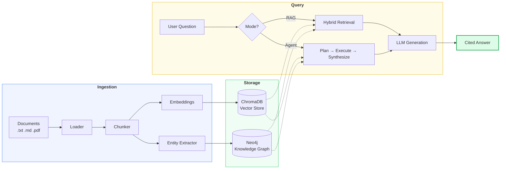
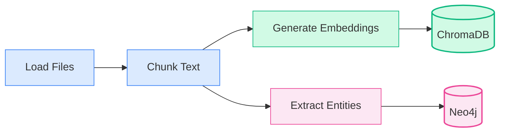
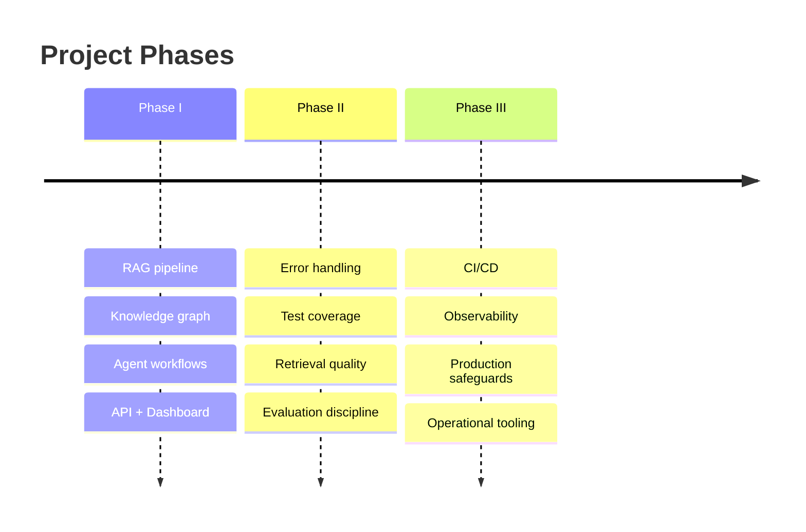

<div align="center">

# Enterprise Document Intelligence

**Ask your documents anything. Get grounded, cited answers.**

RAG + Knowledge Graphs + Agentic Reasoning — built from scratch, runs locally.

[](#prerequisites)
[](#api-reference)
[](#prerequisites)
[](#how-it-works)
[](#how-it-works)

---

*Your documents are scattered across policies, reports, and technical notes.*
*Keyword search doesn't understand what you mean.*
*Relationships between teams, systems, and policies live in people's heads.*
*Complex questions need research, not just a top-5 list.*

**This project fixes all three.**

</div>

---

## What It Does

Drop in your enterprise documents. The system reads them, understands them, connects them, and answers questions about them — with citations.

```
"What is our policy on remote device encryption?"           → RAG mode: instant cited answer
"Compare data security and remote work policies on VPNs"   → Agent mode: multi-step research
```

> **Zero external APIs.** Everything runs on your machine — Ollama for LLM inference, ChromaDB for vectors, Neo4j for the knowledge graph. Your data never leaves your network.

---

## How It Works

### The Big Picture



### Two Ways to Ask

<table>
<tr>
<td width="50%" valign="top">

#### RAG Mode
*Fast, single-pass answers*

```
Question → Embed → Search → Enrich → Generate → Answer
```

1. Converts your question to a vector
2. Finds the most relevant chunks in ChromaDB
3. Pulls related entities from the knowledge graph
4. Assembles context with source labels
5. LLM generates a cited answer

**Best for:** Direct questions with clear answers in your docs.

</td>
<td width="50%" valign="top">

#### Agent Mode
*Multi-step reasoning*

```
Question → Plan → [Tool → Observe]... → Synthesize → Answer
```

1. LLM breaks the question into research steps
2. Executes each step with the right tool
3. Collects all observations
4. Synthesizes a comprehensive answer

**Best for:** Comparisons, cross-document analysis, complex queries.

</td>
</tr>
</table>

### The Agent's Toolbox

When running in agent mode, the system has four tools at its disposal:

| Tool | What it does |
|:---|:---|
| `search_documents` | Hybrid vector + graph search across all ingested content |
| `query_knowledge_graph` | Traverse entity relationships in Neo4j (up to 2 hops) |
| `summarize` | Condense long passages via the LLM |
| `compare_documents` | Retrieve and group documents side-by-side for comparison |

---

## Quick Start

> **Prerequisites:** [Python 3.11+](https://www.python.org/downloads/) &#8226; [Ollama](https://ollama.com/) &#8226; [Docker](https://www.docker.com/)

### One command setup

```bash
make setup
```

This starts Neo4j via Docker, pulls the Ollama models (`llama3.2` + `nomic-embed-text`), and installs the Python package.

<details>
<summary><b>Or do it step by step</b></summary>

```bash
docker compose up -d               # Start Neo4j (browser: 7474, bolt: 7687)
ollama pull llama3.2                # Generation model
ollama pull nomic-embed-text        # Embedding model (768d vectors)
pip install -e ".[dev,ui]"          # Install with dev + UI extras
```

</details>

### Ingest, serve, ask

```bash
make ingest    # Load docs → chunk → embed → store vectors + extract graph
make serve     # Start API at http://localhost:8000
make query     # Interactive prompt → sends question → pretty-prints response
```

### Try it with curl

<details>
<summary><b>RAG mode</b> — single-pass retrieval + generation</summary>

```bash
curl -s -X POST http://localhost:8000/query \
  -H "Content-Type: application/json" \
  -d '{"question": "What is the data security policy?", "mode": "rag", "top_k": 5}' \
  | python -m json.tool
```

</details>

<details>
<summary><b>Agent mode</b> — multi-step reasoning</summary>

```bash
curl -s -X POST http://localhost:8000/query \
  -H "Content-Type: application/json" \
  -d '{"question": "Compare the remote work policy with the data security policy on device requirements", "mode": "agent"}' \
  | python -m json.tool
```

</details>

### Launch the dashboard

```bash
make ui    # Opens Streamlit at http://localhost:8501
```

Three tabs: **Ask** (query with citations), **Graph** (interactive entity explorer with Plotly), **System** (health + stats).

---

## Ingestion Pipeline

Documents go through four stages before they're queryable:



<details>
<summary><b>Stage 1: Document Loading</b></summary>

`src/ingestion/loader.py` recursively walks a directory and loads files by extension:

| Format | Extension | Method |
|:---|:---|:---|
| Plain text | `.txt` | UTF-8 read |
| Markdown | `.md` | UTF-8 read |
| PDF | `.pdf` | Page-by-page extraction via `pypdf`, joined with double newlines |

Each document carries metadata: `source` (file path), `type` (text/markdown/pdf), and `pages` (for PDFs).

</details>

<details>
<summary><b>Stage 2: Chunking</b></summary>

`src/ingestion/chunker.py` provides two strategies:

**Fixed-size** — Character windows of `chunk_size` with `overlap` characters shared between consecutive chunks.

**Recursive** (default) — Splits on the most meaningful boundary first, falling back progressively:

```
Paragraph breaks (\n\n) → Line breaks (\n) → Sentences (. ) → Words ( )
```

Small fragments get merged back together. Overlap characters are preserved between chunks for context continuity. Every chunk carries its source lineage (`source`, `chunk_index`, `strategy`).

</details>

<details>
<summary><b>Stage 3: Embedding + Vector Storage</b></summary>

`src/embeddings/provider.py` calls Ollama's embedding API using `nomic-embed-text`. Vectors are stored in ChromaDB with:

- **Cosine distance** metric (HNSW index)
- **Persistent storage** at `./chroma_data/`
- **Upsert semantics** — re-ingesting updates rather than duplicates (chunk IDs are deterministic SHA-1 hashes)

</details>

<details>
<summary><b>Stage 4: Knowledge Graph Extraction</b></summary>

`src/knowledge_graph/extractor.py` sends document text to the LLM with a structured extraction prompt. The LLM returns:

- **Entities** with category labels: `Person` `Organization` `Policy` `System` `Technology` `Concept` `Process` `Document`
- **Relationships** as directed edges: `RELATES_TO` `PART_OF` `GOVERNS` `USES` `DEPENDS_ON` `DEFINES` `MENTIONS`

Written to Neo4j using idempotent `MERGE` operations. All labels and relationship types are validated against allowlists before Cypher interpolation — no injection through LLM output.

> If Neo4j is unavailable, the pipeline logs a warning and completes without graph extraction. Everything else still works.

</details>

---

## API Reference

Base URL: `http://localhost:8000` &#8226; Swagger UI: `http://localhost:8000/docs`

<details>
<summary><code>GET /health</code> — System health check</summary>

Returns ChromaDB document count and Neo4j connectivity. Status is `"ok"` when both backends are reachable, `"degraded"` if either is down.

```json
{
  "status": "ok",
  "chroma_docs": 42,
  "neo4j_connected": true
}
```

</details>

<details>
<summary><code>POST /ingest</code> — Run ingestion pipeline</summary>

**Request:**
```json
{
  "data_dir": "./data/sample_docs"
}
```

**Response:**
```json
{
  "documents": 6,
  "chunks": 23,
  "entities": 31
}
```

</details>

<details>
<summary><code>POST /query</code> — Ask a question</summary>

**Request:**
```json
{
  "question": "What devices are allowed under the remote work policy?",
  "mode": "rag",
  "top_k": 5
}
```

| Field | Type | Default | Description |
|:---|:---|:---|:---|
| `question` | string | *(required)* | The question to ask |
| `mode` | `"rag"` \| `"agent"` | `"rag"` | Query strategy |
| `top_k` | int (1–20) | `5` | Number of chunks to retrieve |

**Response (RAG):**
```json
{
  "answer": "According to the remote work policy [Source 1]...",
  "mode": "rag",
  "sources": [
    {"source": "data/sample_docs/policies/remote-work-policy.md", "score": 0.847}
  ],
  "graph_context": "Knowledge Graph Context:\n'Remote Work Policy' is related to: ...",
  "agent_steps": []
}
```

**Response (Agent):**
```json
{
  "answer": "Based on my research across multiple documents...",
  "mode": "agent",
  "sources": [],
  "graph_context": "",
  "agent_steps": [
    {
      "thought": "Search for device requirements in policies",
      "tool": "search_documents",
      "input": "device requirements remote work",
      "observation": "[1] (policies/remote-work-policy.md, score=0.823): ..."
    }
  ]
}
```

</details>

<details>
<summary><code>GET /graph/entities</code> — List knowledge graph entities</summary>

**Query params:** `limit` (default: 100)

```json
[
  {"name": "Data Security Policy", "labels": ["Policy"]},
  {"name": "Engineering Team", "labels": ["Organization"]}
]
```

</details>

<details>
<summary><code>GET /graph/neighbors/{entity}</code> — Entity neighborhood</summary>

**Query params:** `max_hops` (default: 2)

```json
[
  {"name": "VPN", "labels": ["Technology"], "distance": 1},
  {"name": "IT Department", "labels": ["Organization"], "distance": 2}
]
```

</details>

<details>
<summary><code>GET /graph/subgraph/{entity}</code> — Visual subgraph data</summary>

**Query params:** `max_hops` (1–4), `node_limit` (1–1000), `edge_limit` (1–2000)

```json
{
  "nodes": [
    {"id": "4:abc123", "name": "Data Security Policy", "labels": ["Policy"]}
  ],
  "edges": [
    {"source": "4:abc123", "target": "4:def456", "type": "GOVERNS"}
  ]
}
```

</details>

---

## Configuration

All settings via environment variables or `.env` file — powered by Pydantic Settings in `src/config.py`.

<details>
<summary><b>Full configuration reference</b></summary>

| Variable | Default | Description |
|:---|:---|:---|
| `OLLAMA_BASE_URL` | `http://localhost:11434` | Ollama API endpoint |
| `OLLAMA_MODEL` | `llama3.2` | Generation + entity extraction model |
| `OLLAMA_EMBED_MODEL` | `nomic-embed-text` | Embedding model |
| `NEO4J_URI` | `bolt://localhost:7687` | Neo4j Bolt URI |
| `NEO4J_USER` | `neo4j` | Neo4j username |
| `NEO4J_PASSWORD` | `password` | Neo4j password |
| `CHROMA_PERSIST_DIR` | `./chroma_data` | ChromaDB storage directory |
| `CHROMA_COLLECTION` | `enterprise_docs` | ChromaDB collection name |
| `CHUNK_SIZE` | `512` | Chunk size in characters |
| `CHUNK_OVERLAP` | `64` | Overlap between chunks |
| `DATA_DIR` | `./data/sample_docs` | Default ingestion directory |

</details>

Example `.env`:

```env
OLLAMA_MODEL=llama3.2
NEO4J_PASSWORD=my_secure_password
CHUNK_SIZE=1024
CHUNK_OVERLAP=128
```

---

## Project Structure

```
enterprise-doc-intel/
├── src/
│   ├── config.py                      # Central settings (env vars / .env)
│   ├── ingestion/
│   │   ├── loader.py                  # File loading (txt, md, pdf)
│   │   ├── chunker.py                # Fixed-size and recursive chunking
│   │   └── pipeline.py               # End-to-end ingestion orchestration
│   ├── embeddings/
│   │   └── provider.py               # Ollama embedding API wrapper
│   ├── vectorstore/
│   │   └── chroma.py                 # ChromaDB persistence and search
│   ├── knowledge_graph/
│   │   ├── extractor.py              # LLM entity/relation extraction
│   │   ├── neo4j_client.py           # Neo4j driver with Cypher safety
│   │   └── query.py                  # Graph context retrieval for RAG
│   ├── rag/
│   │   ├── retriever.py              # Hybrid vector + graph retrieval
│   │   ├── context_builder.py        # Prompt assembly with source attribution
│   │   └── generator.py              # LLM answer generation with citations
│   ├── agents/
│   │   ├── planner.py                # LLM query decomposition
│   │   ├── tools.py                  # Agent tools (search, summarize, compare, graph)
│   │   └── orchestrator.py           # ReAct execution loop and synthesis
│   ├── api/
│   │   ├── app.py                    # FastAPI entry point
│   │   ├── models.py                 # Pydantic request/response schemas
│   │   └── routes/
│   │       ├── health.py             # GET /health
│   │       ├── ingest.py             # POST /ingest
│   │       ├── query.py              # POST /query
│   │       └── graph.py              # GET /graph/*
│   └── ui/
│       └── dashboard.py              # Streamlit dashboard
├── tests/                             # Unit + integration tests
├── data/sample_docs/                  # Sample enterprise documents
│   ├── policies/                      # data-security, leave, remote-work
│   ├── reports/                       # q4-2024-summary
│   └── technical/                     # api-docs, architecture-overview
├── docker-compose.yml                 # Neo4j container
├── pyproject.toml                     # Package + dependencies
├── Makefile                           # Dev shortcuts
└── uv.lock                           # Dependency lock
```

---

## Deep Dive: Module Details

<details>
<summary><b>Embeddings</b> — <code>src/embeddings/provider.py</code></summary>

Calls Ollama's `/api/embed` endpoint:
- `get_embeddings(texts)` — batch embedding for ingestion (iterates one at a time)
- `get_single_embedding(text)` — single embedding for query-time retrieval

</details>

<details>
<summary><b>Vector Store</b> — <code>src/vectorstore/chroma.py</code></summary>

Wraps `chromadb.PersistentClient`:
- `add()` — upserts documents with pre-computed embeddings
- `search()` — top-k cosine similarity, converts ChromaDB distance to similarity (`1 - distance`)
- `reset()` — drops and recreates the collection

</details>

<details>
<summary><b>Knowledge Graph Client</b> — <code>src/knowledge_graph/neo4j_client.py</code></summary>

Neo4j driver wrapper with **Cypher injection protection**. All identifiers are validated against allowlists:
- Labels: `Person` `Organization` `Policy` `System` `Technology` `Concept` `Process` `Document`
- Relationships: `RELATES_TO` `PART_OF` `GOVERNS` `USES` `DEPENDS_ON` `DEFINES` `MENTIONS`
- Unrecognized values fall back to `Concept` / `RELATES_TO`

Key ops: `create_entity`, `create_relationship`, `get_neighbors`, `search_entities`, `get_all_entities`, `get_subgraph`

</details>

<details>
<summary><b>Graph Context Retrieval</b> — <code>src/knowledge_graph/query.py</code></summary>

Two-step process for enriching RAG queries:
1. **Entity extraction** — case-insensitive keyword match against all known entity names
2. **Context building** — for each match, finds neighbors within N hops, formats as natural language

</details>

<details>
<summary><b>Hybrid Retriever</b> — <code>src/rag/retriever.py</code></summary>

Combines vector and graph search:
1. Embed the query, run ChromaDB similarity search
2. If Neo4j is available, extract entities and pull graph context
3. Return both in a `RetrievalResult` — graph failures are caught and logged, never crash the query

</details>

<details>
<summary><b>Context Builder</b> — <code>src/rag/context_builder.py</code></summary>

Formats retrieval into a structured prompt:
```
[Source 1: path/to/doc.md (relevance: 0.847)]
<chunk text>

Knowledge Graph Context:
'Policy X' is related to: Entity A, Entity B
```

</details>

<details>
<summary><b>Generator</b> — <code>src/rag/generator.py</code></summary>

Sends assembled context + question to Ollama. Instructs the LLM to cite sources using `[Source N]` notation. Uses `temperature: 0.1` for focused answers.

</details>

<details>
<summary><b>Agent Planner</b> — <code>src/agents/planner.py</code></summary>

Sends the question + tool descriptions to the LLM. Returns a JSON plan of steps. Falls back to a single `search_documents` step if parsing fails.

</details>

<details>
<summary><b>Agent Orchestrator</b> — <code>src/agents/orchestrator.py</code></summary>

ReAct-style loop: executes the plan step by step (max 8), collects observations (capped at 2000 chars each), then sends everything to the LLM for final synthesis. Returns the answer + full reasoning trace.

</details>

---

## Testing

```bash
make test    # or: pytest -v
```

| Test File | Coverage |
|:---|:---|
| `test_loader.py` | Document loading (txt, md, pdf) |
| `test_chunker.py` | Fixed-size + recursive chunking logic |
| `test_api_models.py` | Pydantic model validation |
| `test_neo4j_client_unit.py` | Neo4j client operations |
| `test_retriever.py` | Hybrid retrieval integration |
| `test_knowledge_graph.py` | Graph extraction integration |
| `test_agent.py` | Agent planner, tools, orchestrator |
| `test_context_builder.py` | RAG context assembly and prompting |
| `test_generator.py` | LLM generation with error handling |
| `test_embeddings.py` | Embedding provider with error paths |
| `test_pipeline.py` | Ingestion pipeline end-to-end |

---

## Roadmap



| Phase | Focus | Status |
|:---|:---|:---:|
| **I** | From-scratch RAG + KG + agents | &#9745; Complete |
| **II** | Hardening, testing, quality controls | &#9745; Complete |
| **III** | Production readiness, CI/CD, observability | &#9744; Planned |

---

## Tech Stack

<table>
<tr>
<td align="center" width="14%"><b>Python 3.11+</b><br/><sub>Runtime</sub></td>
<td align="center" width="14%"><b>FastAPI</b><br/><sub>API Layer</sub></td>
<td align="center" width="14%"><b>Ollama</b><br/><sub>Local LLM</sub></td>
<td align="center" width="14%"><b>ChromaDB</b><br/><sub>Vectors</sub></td>
<td align="center" width="14%"><b>Neo4j</b><br/><sub>Graph DB</sub></td>
<td align="center" width="14%"><b>Streamlit</b><br/><sub>Dashboard</sub></td>
<td align="center" width="14%"><b>Plotly</b><br/><sub>Visualization</sub></td>
</tr>
</table>

Also uses: `pypdf` (PDF parsing) &#8226; `NetworkX` (graph layout) &#8226; `Pydantic` (schemas) &#8226; `httpx` (HTTP client) &#8226; `uv` (dependency locking)

---

<div align="center">
<sub>Built from first principles. No LangChain. No LlamaIndex. Just Python and clear data flow.</sub>
</div>
