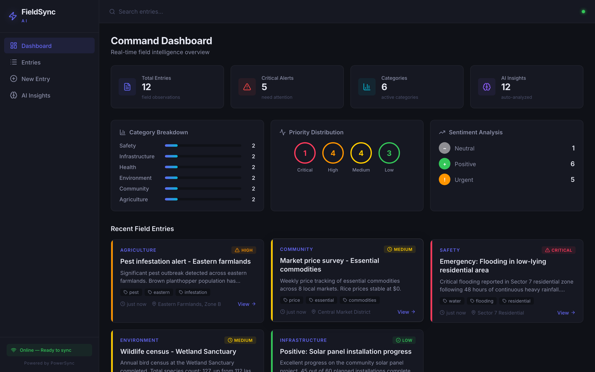
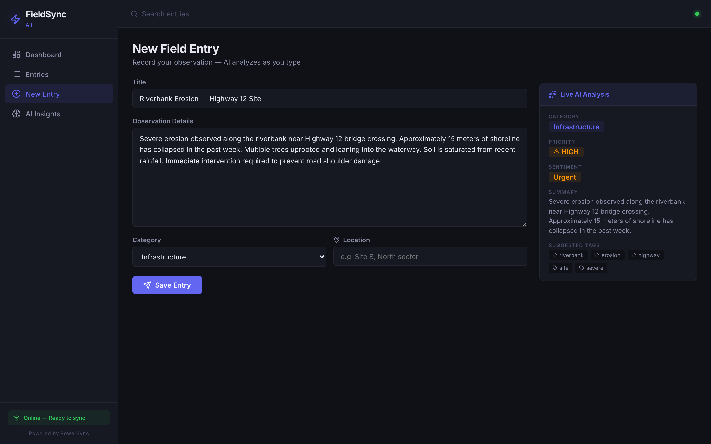
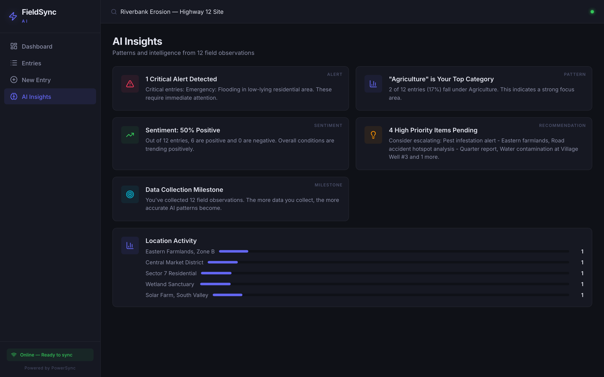
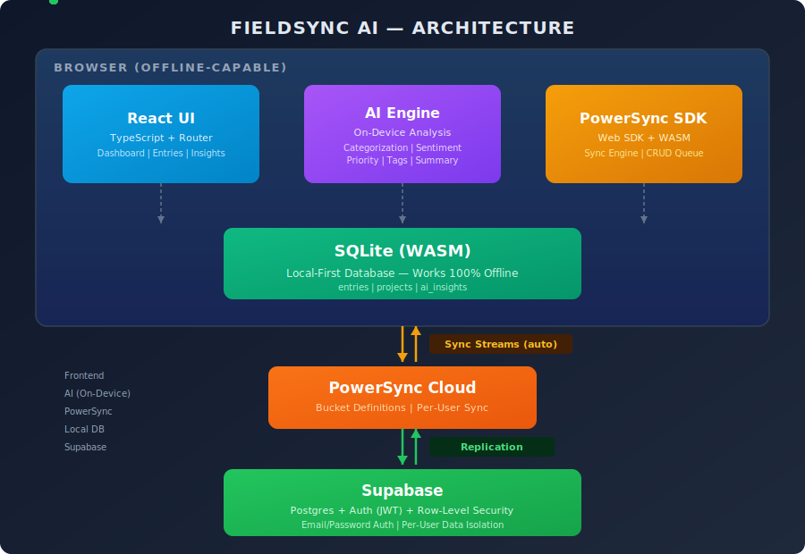

<div align="justify">

# FieldSync AI

[](LICENSE)
[](https://www.typescriptlang.org/)
[](https://react.dev/)
[](https://www.powersync.com/)
[](https://supabase.com/)

**Capture field data anywhere. Get AI insights instantly. Sync when you're ready.**

> *In 2024, during the Maui wildfire recovery, FEMA damage assessment teams documented over 2,200 structures across Lahaina, many in areas where cell towers had burned down. Inspectors resorted to paper forms and offline notes. Back at base, teams spent days manually digitizing, cross-referencing, and prioritizing findings. Critical structural hazards were buried in hundreds of pages of unprocessed notes. Families waiting for rebuilding clearance faced weeks of unnecessary delays.*
>
> *This is not an isolated case. The UN estimates that 2.6 billion people globally lack reliable internet access. Field teams worldwide, from WHO health workers tracking disease outbreaks in rural clinics, to USGS geologists monitoring seismic activity in remote terrain, to conservation biologists documenting endangered species deep in rainforests, still rely on paper forms, offline spreadsheets, or apps that crash the moment they lose signal.*
>
> **FieldSync AI was built so that no critical field data is ever lost again.**

---

## The Problem

Every day, thousands of field workers collect critical observations in locations where internet is unreliable or nonexistent. Environmental researchers in remote forests. Health inspectors in rural clinics. Disaster response teams in flood zones. Agricultural monitors on sprawling farmland.

The tools they are given **fail offline**, **lose data** during sync, and provide **zero intelligent analysis**. A field worker captures 50 observations in a day. Back at base, they spend hours manually categorizing, prioritizing, and searching for patterns. A critical erosion warning gets buried on page 3 of a spreadsheet. An urgent water contamination report sits unread for days because nobody flagged it as high-priority.

## The Solution

FieldSync AI turns raw field observations into structured, AI-analyzed, actionable data, entirely on-device, with seamless cloud sync.

| Step | What Happens |
|------|-------------|
| **Capture** | Record observations with title, detailed notes, category, and location |
| **Analyze** | On-device AI instantly categorizes, detects priority, analyzes sentiment, extracts tags, and generates summaries as you type |
| **Sync** | PowerSync Sync Streams automatically syncs all data to the cloud when connectivity returns with zero conflicts and zero data loss |
| **Act** | Dashboard and Insights pages surface patterns, critical alerts, and trends across all collected data |

---

## Screenshots

| Dashboard | New Entry with Live AI | AI Insights |
|-----------|----------------------|-------------|
|  |  |  |

---

## Features

### Dashboard
- Real-time statistics: total entries, active projects, critical alerts, AI insights generated
- Category breakdown with visual distribution bars
- Priority distribution rings (Critical / High / Medium / Low)
- Sentiment analysis overview (Positive / Neutral / Negative)
- Recent entries feed with quick navigation

### Field Entry Creation with Live AI
- Rich entry form with title, detailed observation notes, category, and location
- **Live AI Analysis Panel** updates in real-time as you type:
  - Auto-detected category (Environmental, Infrastructure, Safety, Health, etc.)
  - Priority assessment (Critical / High / Medium / Low)
  - Sentiment analysis with confidence score
  - Auto-generated summary
  - Intelligent tag extraction

### Entries Management
- Searchable, filterable entry list
- Filter by category, sort by date/priority
- Full entry detail view with AI analysis sidebar

### AI Insights
- Pattern detection across all entries
- Critical alert surfacing that highlights urgent observations needing immediate attention
- Sentiment trend analysis over time
- Location-based activity mapping
- Cross-entry correlation and milestone tracking

### Offline-First Architecture
- **Full functionality without internet**: create, edit, browse, analyze, everything works offline
- Local SQLite database via PowerSync WASM (runs in the browser)
- Automatic bidirectional sync when connectivity returns
- Online/offline status indicator in the UI
- Zero data loss. No "save failed" errors, ever

### Authentication & Security
- Supabase Auth with email/password signup
- Row-Level Security (RLS) so users can only access their own data
- Offline-only mode for quick access without signup
- JWT-based authentication between PowerSync and Supabase

---

## Architecture



### Data Flow

1. **User creates entry** → saved to local SQLite via PowerSync WASM
2. **AI Engine** → analyzes entry content locally, generates insights, saves to local DB
3. **PowerSync SDK** → detects local changes, queues for sync
4. **Sync Streams** → when online, pushes changes to PowerSync Cloud
5. **PowerSync Cloud** → replicates to Supabase Postgres
6. **Supabase RLS** → enforces per-user data isolation

---

## Tech Stack

| Layer | Technology | Purpose |
|-------|-----------|---------|
| Frontend | React 19 + TypeScript | Component-based UI with full type safety |
| Build | Vite 7 | Fast dev server and optimized production builds |
| Local Database | PowerSync Web SDK | WASM-based SQLite running in the browser |
| Sync Engine | PowerSync Sync Streams | Real-time bidirectional sync with conflict resolution |
| Backend | Supabase (Postgres) | Cloud database with Row-Level Security |
| Auth | Supabase Auth | JWT-based email/password authentication |
| AI | Custom on-device engine | NLP-based categorization, sentiment analysis, priority detection |
| Hosting | Vercel | Production deployment with COOP/COEP headers for WASM |

---

## Design Philosophy

### Why On-Device AI?

Most AI-powered apps send data to external APIs for processing. That approach fundamentally conflicts with offline-first. If there is no internet, there is no AI. FieldSync AI embeds the intelligence engine directly in the browser. Analysis happens in real-time as the user types, with zero latency, zero API costs, and complete data privacy. The AI works in airplane mode, in a forest, in a flood zone, wherever the user needs it.

### Why Local-First?

The app initializes PowerSync's local SQLite database before rendering any UI. Every read and write goes through the local database first, never through network calls. This means the app is fast by default (no loading spinners waiting for API responses) and resilient by design (network failures are invisible to the user). Sync is an enhancement, not a dependency.

### PowerSync as Core Infrastructure

PowerSync is not a bolt-on sync layer. It is the foundation of the entire data architecture:

- **PowerSync Web SDK** provides the local SQLite database via WASM that the entire app reads from and writes to
- **Sync Streams** configured with `bucket_definitions` for per-user data sync using `request.user_id()` parameter queries
- **Backend Connector** implements `PowerSyncBackendConnector` for credential management and CRUD upload to Supabase
- **Lifecycle management**: `connectSync()` after authentication, `disconnectSync()` on logout, sync state managed throughout the app
- **WASM worker configuration**: Vite configured with `worker: { format: 'es' }` and `optimizeDeps.exclude` for proper WASM loading

Removing PowerSync would require rewriting the entire data layer. It cannot be swapped out.

### Technical Decisions

- **TypeScript throughout**: full type safety across schema, connectors, store, and UI
- **Singleton database pattern**: prevents multiple PowerSync instances from being created
- **Environment-aware auth**: detects if credentials are configured and seamlessly enters offline mode if not
- **Supabase RLS policies**: row-level security ensures complete data isolation between users
- **COOP/COEP headers**: production deployment configured with `Cross-Origin-Opener-Policy: same-origin` and `Cross-Origin-Embedder-Policy: credentialless` for SharedArrayBuffer support required by PowerSync WASM

### Who Is This For?

- **Environmental researchers** monitoring erosion, wildlife, and pollution in remote areas
- **Health workers** collecting patient data in rural clinics without connectivity
- **Disaster response teams** documenting damage assessments in affected zones
- **Construction inspectors** logging observations across large sites
- **Agricultural workers** recording crop conditions across farms

---

## Getting Started

### Prerequisites
- Node.js 18+
- Supabase account ([supabase.com](https://supabase.com), free tier works)
- PowerSync account ([dashboard.powersync.com](https://dashboard.powersync.com), free tier works)

### 1. Clone & Install

```bash
git clone https://github.com/mahesh-sadupalli/fieldsync-ai.git
cd fieldsync-ai
npm install
```

### 2. Supabase Setup

1. Create a new project at [supabase.com](https://supabase.com)
2. Go to SQL Editor and run the contents of `supabase/schema.sql`
3. Copy your **Project URL** and **anon key** from Settings → API

### 3. PowerSync Setup

1. Create a new instance at [dashboard.powersync.com](https://dashboard.powersync.com)
2. Connect your Supabase Postgres database (connection string from Supabase Settings → Database)
3. Deploy sync rules from `powersync/sync-streams.yaml` in the Sync Streams editor
4. Set JWKS URI to: `https://YOUR_PROJECT.supabase.co/auth/v1/jwks`

### 4. Configure Environment

```bash
cp .env.local.template .env.local
```

Fill in your credentials:
```env
VITE_SUPABASE_URL=https://YOUR_PROJECT.supabase.co
VITE_SUPABASE_ANON_KEY=your-anon-key
VITE_POWERSYNC_URL=https://YOUR_INSTANCE.powersync.journeyapps.com
```

### 5. Run

```bash
npm run dev
```

---

## Project Structure

```
fieldsync-ai/
├── src/
│   ├── components/       # Reusable UI components (Layout, Sidebar)
│   ├── hooks/            # Custom React hooks
│   ├── lib/
│   │   ├── ai.ts         # On-device AI analysis engine
│   │   ├── auth.ts       # Supabase auth helpers
│   │   ├── connector.ts  # PowerSync backend connector
│   │   ├── powersync.ts  # Database initialization & sync management
│   │   ├── seed.ts       # Demo data for testing
│   │   ├── store.ts      # CRUD operations for entries/projects/insights
│   │   └── supabase.ts   # Supabase client initialization
│   ├── pages/
│   │   ├── Dashboard.tsx  # Stats, charts, overview
│   │   ├── Entries.tsx    # Entry list with search/filter
│   │   ├── EntryDetail.tsx# Full entry view + AI sidebar
│   │   ├── Insights.tsx   # AI-generated patterns & alerts
│   │   ├── Login.tsx      # Auth page
│   │   └── NewEntry.tsx   # Entry form + live AI panel
│   ├── types/
│   │   └── schema.ts     # PowerSync schema + TypeScript types
│   ├── App.tsx           # Root component with auth state management
│   ├── App.css           # Global styles
│   └── main.tsx          # Entry point
├── supabase/
│   └── schema.sql        # Database schema + RLS policies
├── powersync/
│   └── sync-streams.yaml # Sync Streams bucket definitions
├── vercel.json           # Production headers (COOP/COEP for WASM)
└── vite.config.ts        # Vite config with PowerSync WASM support
```

---

## Team Members

- Mahesh Sadupalli

## License

MIT

</div>
