

# Fourier Neural Operator for Dynamical Systems

**Learning PDE dynamics directly from data using neural operators that generalize across spatial resolutions.**

Part of the [AI in the Sciences and Engineering](https://camlab-ethz.github.io/ai4s-course/) course at ETH Zurich.

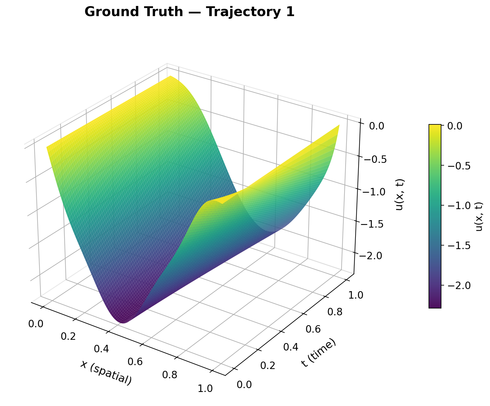

---

## The Problem

We are given trajectories from an **unknown dynamical system**:

$$\frac{\partial u}{\partial t} = \mathcal{D}(u(x,t)), \quad t \in (0,1], \; x \in [0,1]$$

with boundary conditions $u(0,t) = u(1,t) = 0$ and initial condition $u(x,0) = u_0(x)$.

We don't know $\mathcal{D}$. We only have **snapshot data** — solutions sampled at $t \in \{0, 0.25, 0.50, 0.75, 1.0\}$ across 1024 trajectories. The goal: learn an operator that maps initial conditions to future states, **purely from data**.

> This is the central promise of neural operators — replacing expensive numerical solvers with learned surrogates that are orders of magnitude faster at inference.

<b>Dataset Samples</b> — click to expand

 

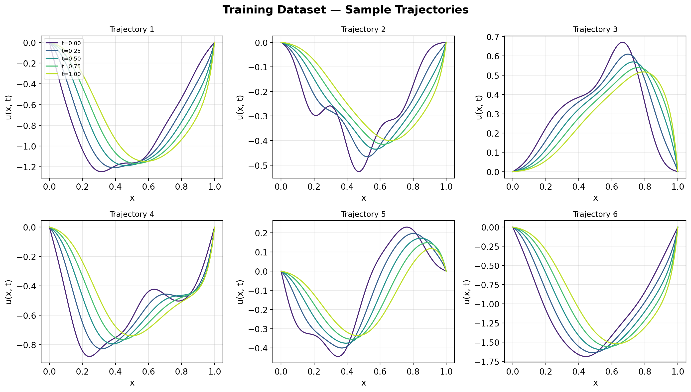

6 representative trajectories from the training set. Each curve shows the solution $u(x, t)$ at 5 time snapshots, revealing diverse wave propagation and diffusion patterns.

---

## Why Fourier Neural Operators?

### The Limitation of Standard Neural Networks

A standard neural network (e.g., an MLP or CNN) learns a **fixed-dimensional function**:

$$f_\theta : \mathbb{R}^n \to \mathbb{R}^m$$

If you train on a 128-point grid, the network is locked to that grid. Change the resolution and you need to retrain. This is fundamentally limiting for physical systems that exist in continuous space.

### From Functions to Operators

Physical systems are governed by **operators** — mappings between infinite-dimensional function spaces:

$$\mathcal{G}^\dagger : \mathcal{A} \to \mathcal{U}$$

where $\mathcal{A}$ is the space of input functions (e.g., initial conditions) and $\mathcal{U}$ is the space of solutions. Neural operators learn this mapping directly.

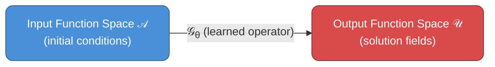

### The Fourier Layer — Core Innovation

The key insight behind FNO is that many PDE operators are **diagonal in Fourier space**. Instead of learning convolution kernels in physical space (which is local), FNO learns **global interactions in the frequency domain**.

Each Fourier layer performs:

$$v_{l+1}(x) = \sigma\Big(W_l \, v_l(x) + \mathcal{F}^{-1}\big(R_l \cdot \mathcal{F}(v_l)\big)(x)\Big)$$

where:
- $\mathcal{F}$ / $\mathcal{F}^{-1}$ — Fast Fourier Transform and its inverse
- $R_l$ — learnable weight tensor in Fourier space (truncated to $k_{\max}$ modes)
- $W_l$ — pointwise linear transform (local path)
- $\sigma$ — nonlinear activation (GELU)

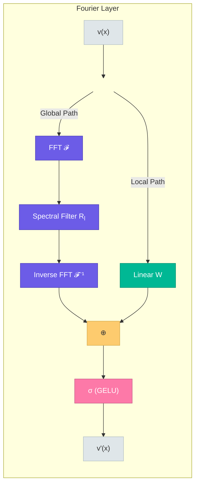

### Resolution Invariance

Because the Fourier transform is defined on continuous functions and we only keep the lowest $k_{\max}$ modes, the learned operator **transfers across resolutions**. Train on 128 points, evaluate on 32 or 256 — the same weights work because the spectral representation is resolution-agnostic.

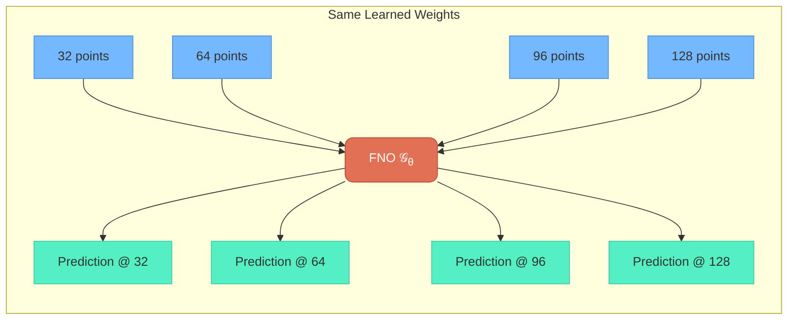

---

## Full Architecture

The complete FNO pipeline stacks multiple Fourier layers between a lifting layer (projection to higher dimension) and a projection layer (back to output dimension):

$$u_0(x) \;\xrightarrow{\text{Lift } P}\; v_0(x) \;\xrightarrow{\text{Fourier Layer } \times L}\; v_L(x) \;\xrightarrow{\text{Project } Q}\; u(x, t)$$

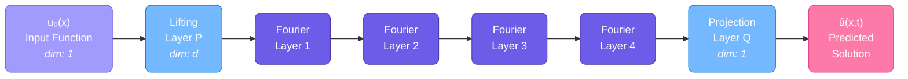

**Model Configuration:**

| Hyperparameter | Value |
|:---|:---|
| Fourier Modes | 16 |
| Hidden Width | 64 |
| Fourier Layers | 4 |
| Parameters | 287K |
| Optimizer | Adam + ReduceLROnPlateau |

---

## Results

### Task 1: One-to-One Training (10 pts)

Learn the direct mapping $u_0 \mapsto u(t=1.0)$ using 1024 training trajectories.

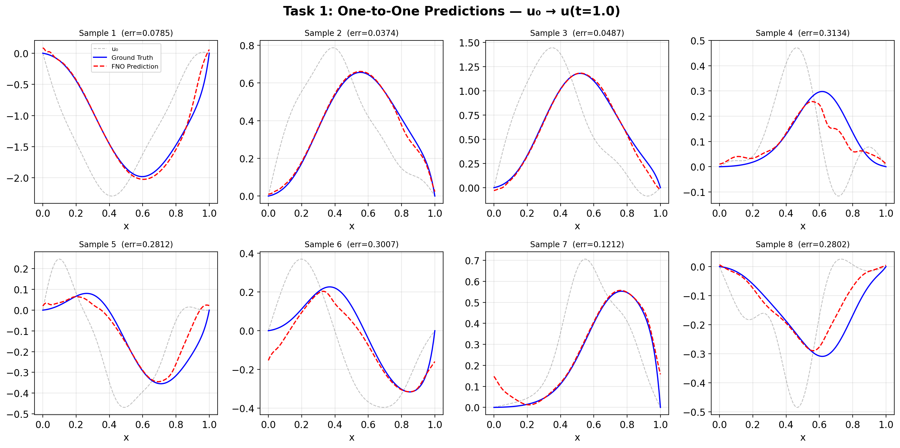

| Metric | Value |
|:---|:---|
| Training Epochs | 253 (early stopped) |
| Final Train Loss | 1.52e-03 |
| **Test Relative L² Error** | **0.1203** |

---

### Task 2: Multi-Resolution Testing (10 pts)

Test the same trained model (no retraining) on grids of different spatial resolution. This demonstrates FNO's core property — **resolution invariance**.

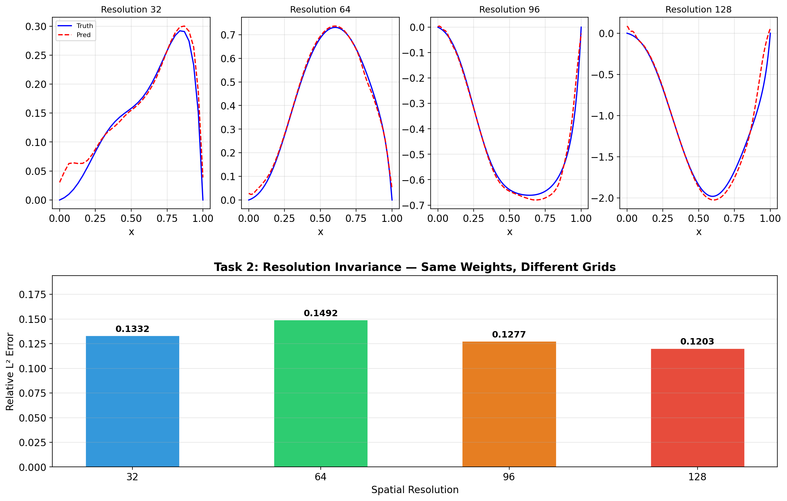

| Resolution | Relative L² Error |
|:---:|:---:|
| 32 | 0.1332 |
| 64 | 0.1492 |
| 96 | 0.1277 |
| **128** (train) | **0.1203** |

> Errors remain within a ~3% band across a 4x resolution range, confirming that spectral features transfer across discretizations.

---

### Task 3: All-to-All Time-Dependent Training (15 pts)

Train a time-conditioned FNO using all 5 time snapshots. Input channels: $[u(t_i),\; t_i,\; t_j]$.

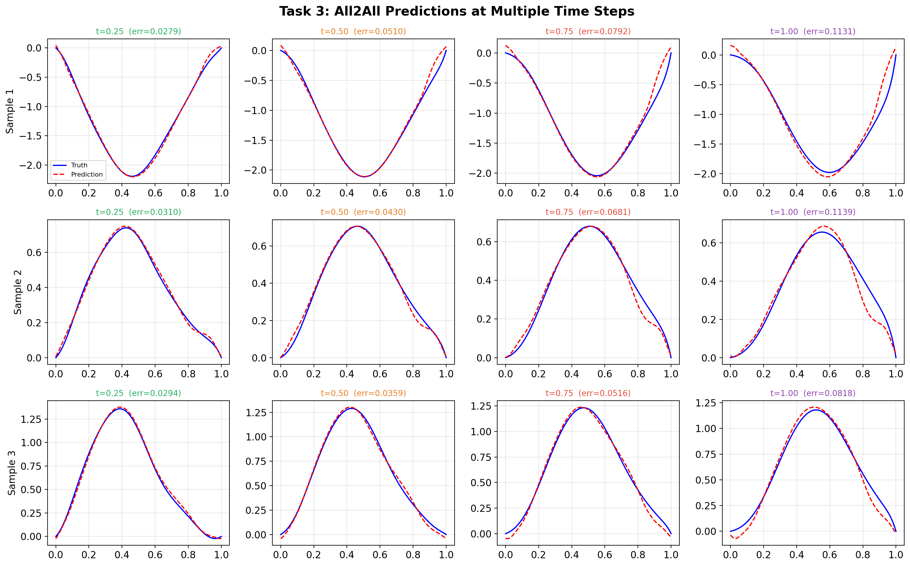

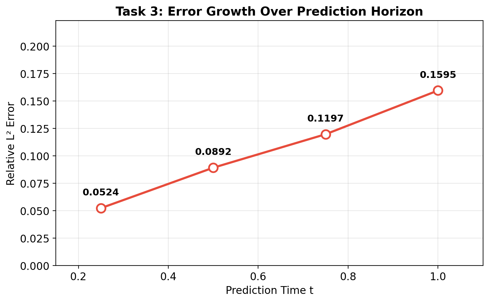

| Prediction Time | Relative L² Error |
|:---:|:---:|
| t = 0.25 | 0.0524 |
| t = 0.50 | 0.0892 |
| t = 0.75 | 0.1197 |
| t = 1.00 | 0.1595 |

> Error grows approximately linearly with the prediction horizon — shorter-range predictions are significantly more accurate.

---

### Task 4: Fine-Tuning & Transfer Learning (15 + 10 bonus pts)

Test the all2all model on a **shifted initial condition distribution** (zero-shot), then fine-tune with only 32 trajectories. Compare against training from scratch.

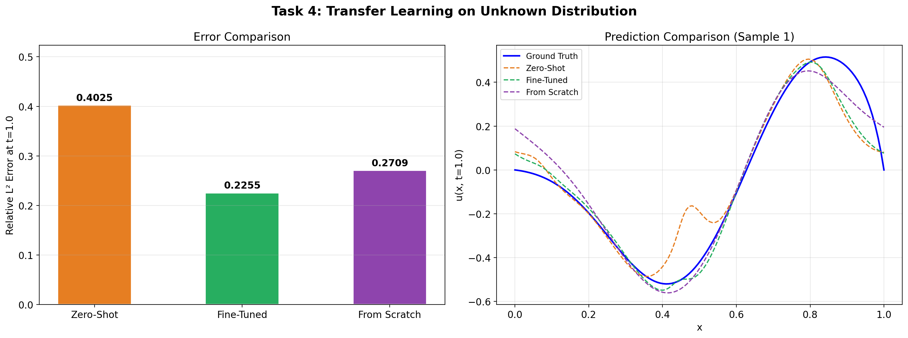

| Method | L² Error at t=1.0 | Improvement |
|:---|:---:|:---:|
| Zero-Shot (no adaptation) | 0.4025 | — |
| **Fine-Tuned** (32 trajectories) | **0.2255** | **44% reduction** |
| From Scratch (32 trajectories) | 0.2709 | 33% reduction |

> Fine-tuning outperforms training from scratch by ~17%, confirming that **transfer learning is successful** — pretrained spectral features generalize across distributions.

---

### 3D Spatiotemporal Visualization

Full spatiotemporal evolution as 3D surfaces ($x$ vs $t$ vs $u$) — comparing ground truth, FNO prediction, and absolute error.

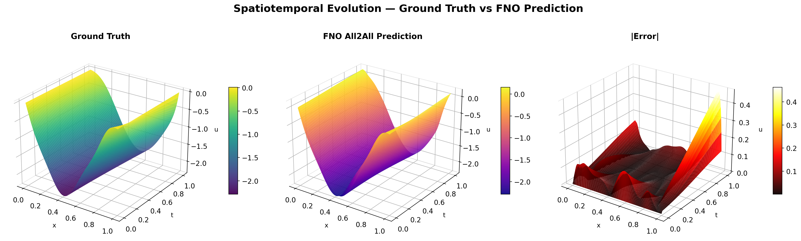

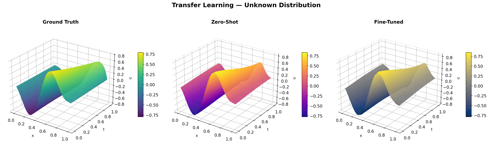

<b>Spatiotemporal Heatmaps</b> — click to expand

 

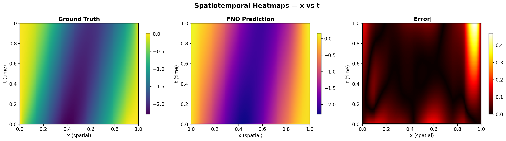

Top-down view of the same data — error concentrates at later time steps and near boundary regions.

<b>Summary Dashboard</b> — click to expand

 

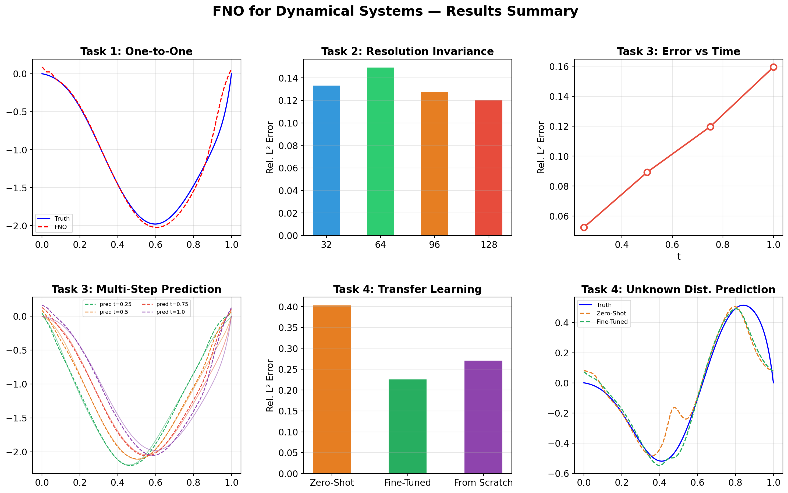

---

## Training Strategies

### One-to-One (Task 1)

Learn a direct mapping from initial condition to final state:

$$\mathcal{G}_\theta : u_0 \mapsto u(t = 1.0)$$

Simple and fast — but the model sees only two snapshots per trajectory and cannot predict intermediate times.

### All-to-All (Task 3)

Use **all time snapshots** to train a time-conditioned model:

$$\mathcal{G}_\theta : (u(t_i),\; t_i,\; t_j) \mapsto u(t_j)$$

This requires **time-conditional normalization** — injecting the target time as an additional input channel so the model knows *when* to predict. The model learns the full temporal dynamics, not just a single-step map.

### Fine-Tuning & Transfer Learning (Task 4)

When the initial condition distribution shifts (unknown distribution), the pretrained model degrades. **Fine-tuning** adapts the learned operator to a new regime using minimal data (32 trajectories), demonstrating that the spectral features learned by FNO are transferable across distributions.

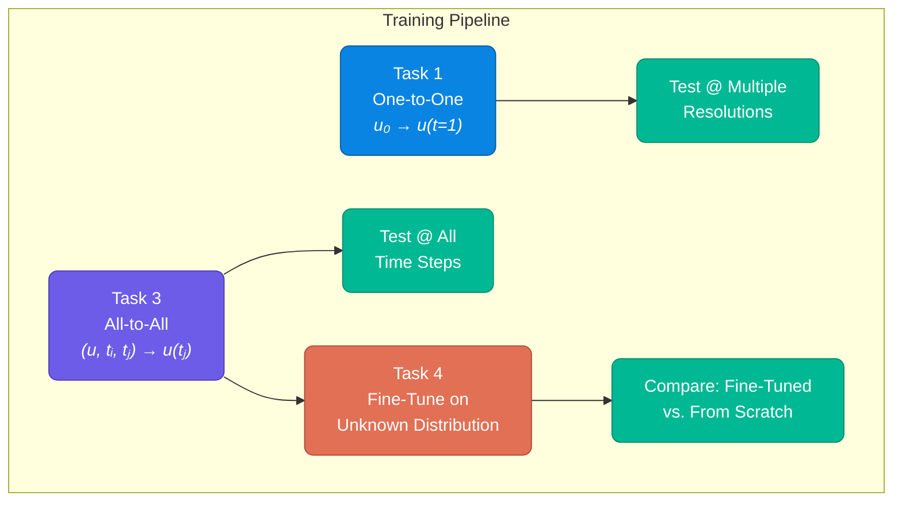

---

## Key References

| Paper | Contribution |
|:---|:---|
| [Li et al., 2021 — *Fourier Neural Operator for Parametric PDEs*](https://arxiv.org/abs/2010.08895) | Introduced FNO with spectral convolutions for resolution-invariant operator learning |
| [Li et al., 2023 — *Fourier Neural Operator with Learned Deformations*](https://arxiv.org/abs/2207.05209) | Extended FNO with geometry-adaptive deformations |
| [Kovachki et al., 2023 — *Neural Operator: Learning Maps Between Function Spaces*](https://arxiv.org/abs/2108.08481) | Unified theoretical framework for neural operators |

---

Built as part of <a href="https://camlab-ethz.github.io/ai4s-course/">AI in the Sciences and Engineering</a> at ETH Zurich

