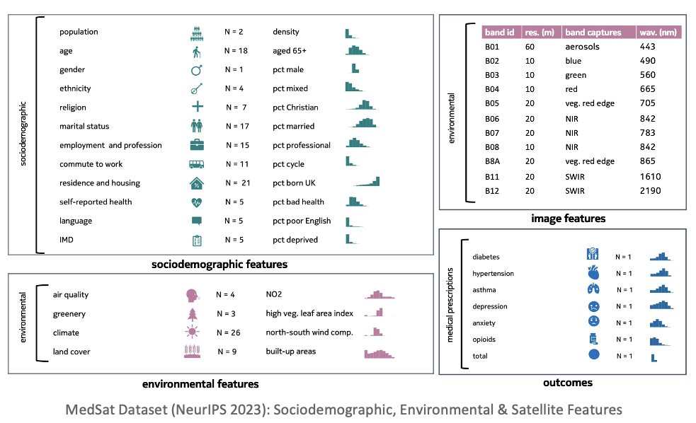
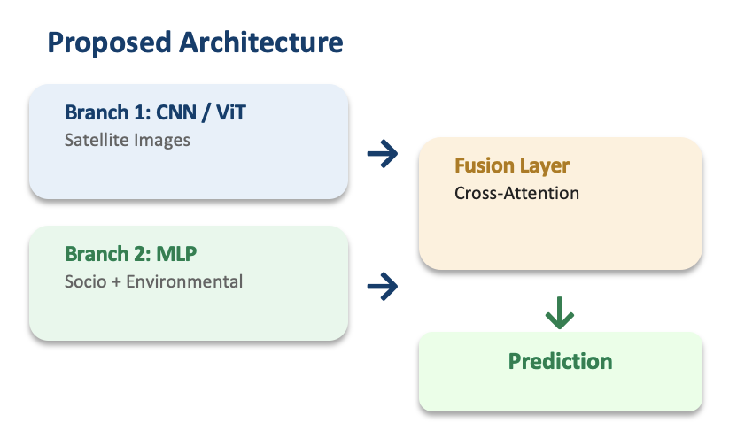

# Multimodal Deep Learning for Medical Prescription Prediction

## Project Overview

This project proposes a multimodal deep learning architecture to predict medical prescription prevalence across England using satellite imagery, environmental data, and sociodemographic features. It is built on top of the [MedSat dataset](https://proceedings.neurips.cc/paper_files/paper/2023/file/ffd8f67c9b3d1dc06e91290a0fcfd8f6-Paper-Datasets_and_Benchmarks.pdf) (NeurIPS 2023), which serves as a benchmark for the research community — while the proposed model architecture and fusion strategy represent an independent contribution.

**Relevance:** Environmental factors such as air quality significantly impact individual well-being and are recognized risk factors for diseases including asthma, anxiety, and depression. Traditional monitoring methods are limited in spatial and temporal resolution. This research explores the potential of integrating AI with satellite imagery to assess environmental factors and their relationship to public health outcomes at scale.

**Long-term Goal:** Develop an analogous model for Germany using similar data sources.

## Dataset — Three Data Modalities

The MedSat dataset covers 33,755 LSOAs (Lower Layer Super Output Areas) across England:

<p align="center">
  
</p>

| Modality | Description | Details |
|----------|-------------|---------|
| **Satellite Imagery** | Sentinel-2 multispectral data | 10 spectral bands, 443nm–2190nm range, 10m/20m resolution |
| **Sociodemographic** | UK Census 2021, IMD, health indices | 111 features covering demographics, deprivation, and health |
| **Environmental** | Air quality, greenery, climate, land cover | 43 features (NO2, PM2.5, ozone, NDVI, temperature) |

### Prediction Targets

- **Metabolic:** Diabetes, Hypertension
- **Respiratory:** Asthma
- **Mental Health:** Depression, Anxiety
- **Other:** Opioids

## Proposed Architecture

<p align="center">
  
</p>

The model follows a two-branch multimodal fusion design:

**Branch 1 — Image Encoder (CNN / ViT)**
- Processes Sentinel-2 satellite images (10 spectral bands)
- Extracts spatial features from multispectral imagery
- Candidate architectures: ResNet, EfficientNet, or Vision Transformer (ViT)

**Branch 2 — Tabular Encoder (MLP)**
- Processes sociodemographic features (census, IMD, health indices)
- Processes environmental features (air quality, greenery, climate)
- Multi-layer perceptron for structured/tabular data

**Fusion Layer — Cross-Attention**
- Combines image embeddings and tabular embeddings
- Cross-attention mechanism allows each modality to attend to the other
- Fused representation feeds into the final prediction head

## My Contribution: Satellite Image Preprocessing

The complete satellite image preprocessing pipeline was developed as part of this project:

- Processing Sentinel-2 GeoTIFF files (10 spectral bands, 443nm–2190nm)
- Handling dual native resolutions (10m and 20m bands)
- Band normalization across tiles for consistent input ranges
- Spatial resampling to uniform resolution
- Quality filtering with cloud masking
- Geospatial mapping to align satellite tiles with LSOA boundaries for tabular integration

## Project Structure

```
multimodal-medsat/
├── README.md
├── config.yaml                  # Training and data configuration
├── config_local.yaml            # Local path overrides
├── requirements.txt
├── data/
│   ├── raw/                     # Original MedSat data
│   ├── processed/               # Preprocessed features
│   └── shapefiles/              # LSOA boundary files
├── models/
│   └── saved_models/            # Trained model checkpoints
├── results/
│   ├── figures/                 # Visualizations
│   ├── metrics/                 # Evaluation results
│   └── reports/                 # Analysis reports
├── src/
│   ├── data_processing/         # Data loading and preprocessing
│   ├── models/                  # Model architectures
│   ├── utils/                   # Helper functions
│   └── visualization/           # Plotting utilities
├── tests/
└── images/                      # Architecture diagrams
```

## Tech Stack

- **Python** — PyTorch, torchvision, rasterio
- **Image Processing** — Sentinel-2 GeoTIFF handling, band normalization, spatial resampling
- **Deep Learning** — CNN/ViT (image branch), MLP (tabular branch), Cross-Attention fusion
- **Data** — pandas, NumPy, geopandas, scikit-learn

## References

- Elias, P. et al. (2023). MedSat: A Public Health Dataset for England Featuring Medical Prescriptions and Satellite Imagery. NeurIPS 2023 Datasets and Benchmarks Track.
