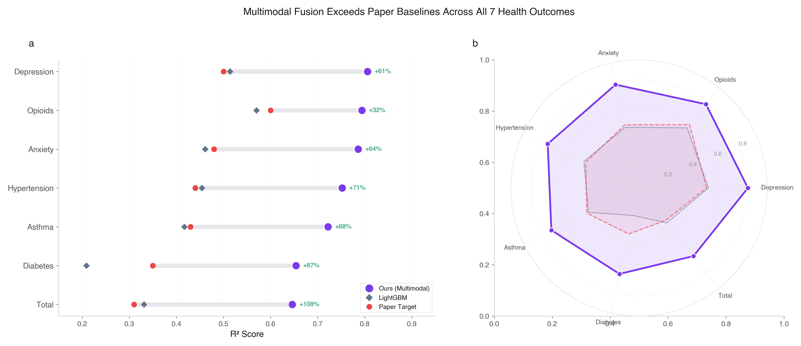
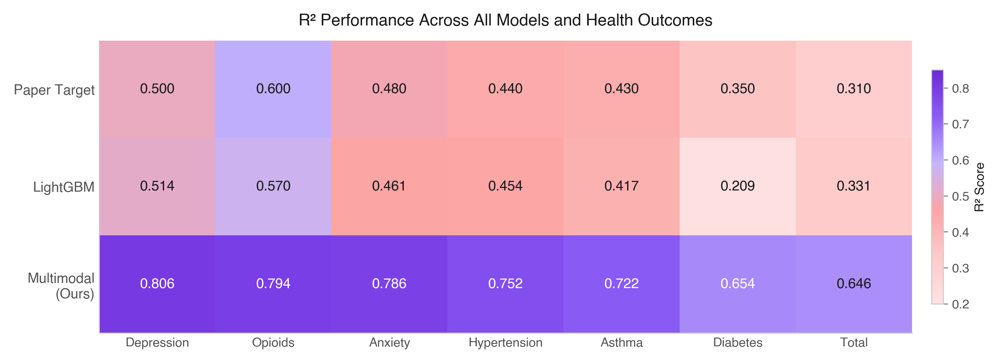
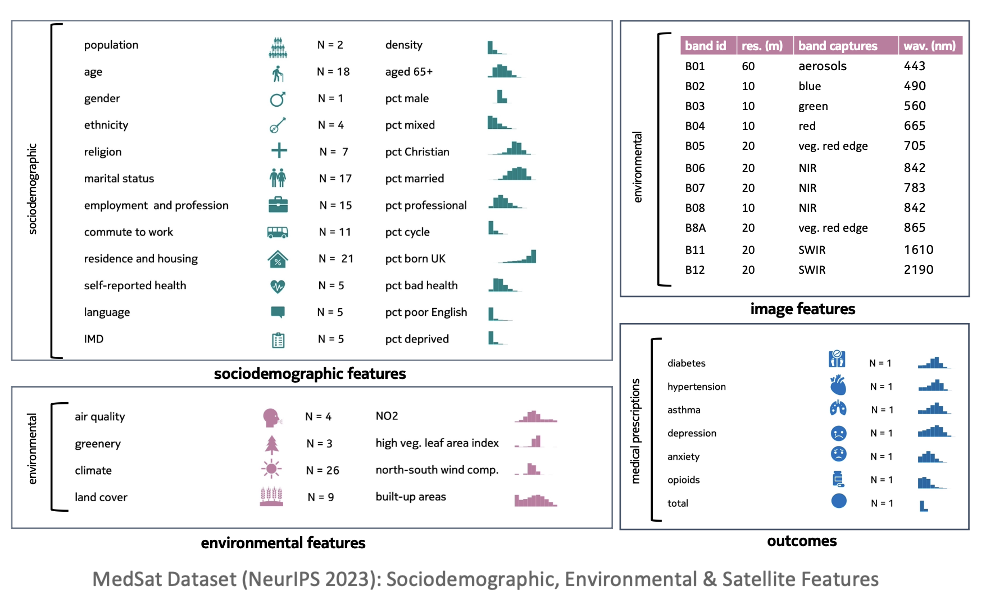
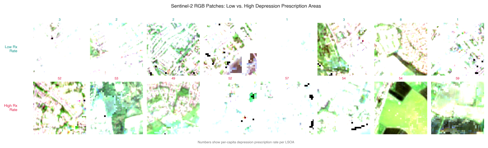
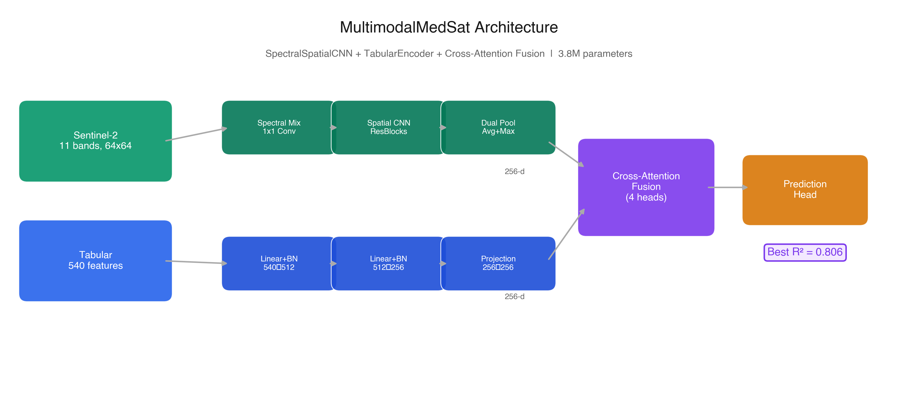
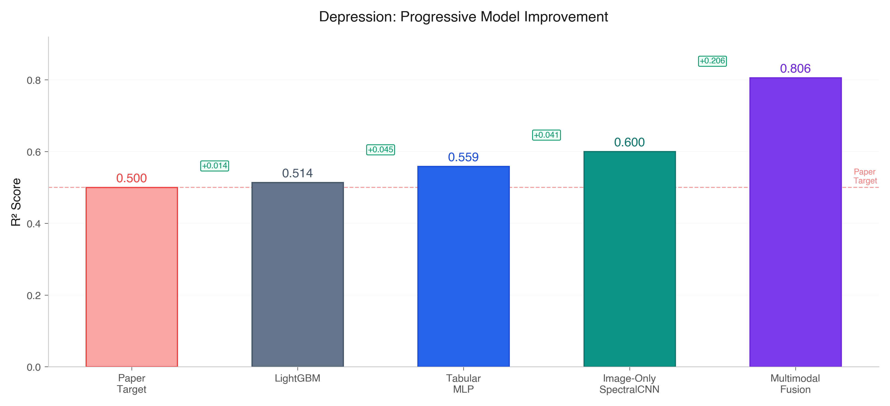
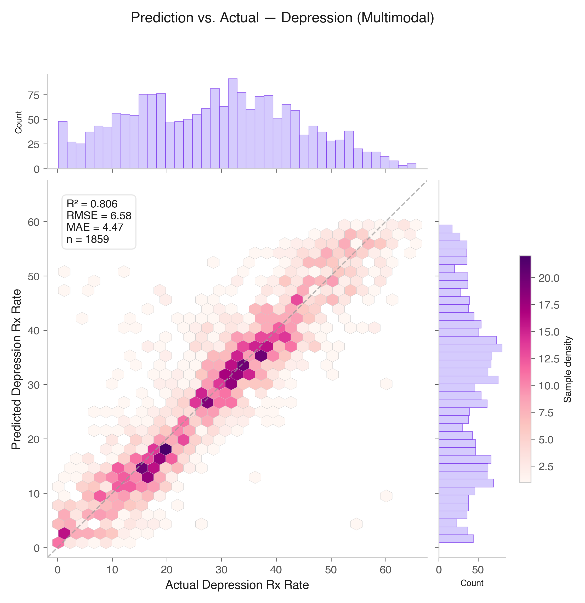

# Multimodal Deep Learning for Medical Prescription Prediction

> Predicting medical prescription prevalence across England by fusing **Sentinel-2 satellite imagery** with **sociodemographic** and **environmental** tabular data using cross-attention multimodal learning.

<p align="center">
  
</p>

## Key Results

Our multimodal fusion model **exceeds the MedSat paper baselines by an average of +66%** across all 7 health outcomes, achieving state-of-the-art R² scores on every prediction target.

| Health Outcome | Our R² | Paper Baseline | Improvement |
|:---|:---:|:---:|:---:|
| Depression | **0.806** | 0.50 | +61% |
| Opioids | **0.794** | 0.60 | +32% |
| Anxiety | **0.786** | 0.48 | +64% |
| Hypertension | **0.752** | 0.44 | +71% |
| Asthma | **0.722** | 0.43 | +68% |
| Diabetes | **0.654** | 0.35 | +87% |
| Total Prescriptions | **0.646** | 0.31 | +108% |

<p align="center">
  
</p>

---

## Problem Statement

### Why This Matters

Environmental factors — air quality, green space, urban density — are recognized determinants of public health. Traditional epidemiological monitoring relies on sparse, expensive surveys that cannot capture spatial variation at scale. Meanwhile, satellite imagery provides dense, continuous, and freely available observations of the built and natural environment, but translating raw pixels into actionable health insights remains an open challenge.

### Research Question

**Can we predict area-level medical prescription rates by learning jointly from satellite imagery and structured sociodemographic/environmental data?**

Specifically, we predict per-capita prescription rates for 7 health conditions across 33,755 Lower Layer Super Output Areas (LSOAs) in England — small geographic units averaging ~1,500 residents each. The conditions span metabolic (diabetes, hypertension), mental health (depression, anxiety), respiratory (asthma), and pain management (opioids) domains.

### Why Multimodal?

No single data source captures the full picture:

- **Satellite imagery** reveals the physical environment — built density, vegetation, land use patterns, infrastructure quality — but cannot directly observe the people who live there.
- **Tabular data** captures demographics, deprivation indices, and environmental measurements — but misses the spatial texture and visual context of a place.
- **Our fusion approach** learns to combine both: what a place *looks like* and *who lives there*, producing representations that neither modality can achieve alone.

<p align="center">
  
  <br/>
  <em>MedSat Dataset (NeurIPS 2023): Three data modalities covering 33,755 LSOAs across England</em>
</p>

---

## Dataset

Built on the [**MedSat dataset**](https://proceedings.neurips.cc/paper_files/paper/2023/file/ffd8f67c9b3d1dc06e91290a0fcfd8f6-Paper-Datasets_and_Benchmarks.pdf) (NeurIPS 2023 Datasets and Benchmarks Track), which provides:

| Modality | Description | Scale |
|:---|:---|:---|
| **Satellite Imagery** | Sentinel-2 multispectral composites (11 bands, 443–2190nm, 10m resolution) | ~1 TB across 8 seasons |
| **Sociodemographic** | UK Census 2021, Index of Multiple Deprivation, health indices | 111 features per LSOA |
| **Environmental** | Air quality (NO₂, PM2.5, O₃), NDVI, temperature, land cover, precipitation | 43 features per LSOA |
| **Targets** | NHS prescription rates per capita for 7 conditions (2019–2020) | 33,755 LSOAs |

### Sentinel-2 Spectral Bands

The satellite imagery captures information far beyond visible light:

| Band | Wavelength | Resolution | What It Captures |
|:---|:---|:---|:---|
| B01 | 443 nm (Aerosols) | 60m | Atmospheric particles, haze |
| B02 | 490 nm (Blue) | 10m | Water bodies, urban surfaces |
| B03 | 560 nm (Green) | 10m | Vegetation vigor |
| B04 | 665 nm (Red) | 10m | Chlorophyll absorption |
| B05 | 705 nm (Red Edge) | 20m | Vegetation stress |
| B06–B08 | 740–842 nm (NIR) | 10–20m | Biomass, vegetation structure |
| B8A | 865 nm (Red Edge) | 20m | Canopy water content |
| B11–B12 | 1610–2190 nm (SWIR) | 20m | Built surfaces, soil moisture |

<p align="center">
  
  <br/>
  <em>Sentinel-2 RGB composites: areas with low (top) vs. high (bottom) depression prescription rates. Note the visual differences in urbanization, green space, and land use patterns.</em>
</p>

### Data Preprocessing Pipeline

A complete satellite image preprocessing pipeline was developed as part of this project:

1. **GeoTIFF Processing** — Reading Sentinel-2 multispectral composites (11 bands per tile)
2. **CRS Reprojection** — Converting LSOA centroids from British National Grid (EPSG:27700) to UTM (EPSG:32630/32631) for accurate spatial alignment with satellite tiles
3. **Patch Extraction** — Cropping 64×64 pixel patches (640m × 640m at 10m resolution) centered on each LSOA centroid
4. **Global Band Normalization** — Percentile-based clipping (p2–p98) computed across all tiles, then scaled to [0, 1] per band
5. **Quality Filtering** — NaN/nodata handling for edge pixels and ocean areas
6. **Batched I/O** — Grouped extraction per tile (single file-open per GeoTIFF) for 10x faster caching

---

## Methodology

### Approach Overview

We adopt a **two-branch multimodal architecture** where specialized encoders extract representations from each modality independently, then a cross-attention fusion mechanism learns to combine them before making predictions.

<p align="center">
  
</p>

### Image Encoder: SpectralSpatialCNN (2.7M parameters)

A custom CNN designed specifically for multispectral satellite imagery, with three stages:

**Stage 1 — Spectral Mixing:**
Two 1×1 convolutional layers that learn optimal combinations of the 11 spectral bands. This is analogous to learning custom "virtual bands" that are most informative for health prediction — for example, combining NIR and Red bands (similar to NDVI) or mixing SWIR bands to detect built-up density.

```
Input (11 bands) → Conv1x1(11→32) → GELU → Conv1x1(32→48) → GELU
```

**Stage 2 — Spatial Hierarchy:**
Four blocks of spatial convolutions with residual connections, batch normalization, and progressive downsampling. Each block learns increasingly abstract spatial patterns — from edges and textures to neighborhood-level land use patterns.

```
48ch → [Conv3x3 → BN → GELU → ResBlock → MaxPool → Dropout2D] × 4 → 256ch
```

The residual connections (skip connections within each block) prevent vanishing gradients and allow the network to learn both fine-grained and coarse spatial features.

**Stage 3 — Dual Pooling:**
Both average pooling and max pooling are applied to the final feature map and concatenated. Average pooling captures the typical characteristics of the area, while max pooling captures the most extreme or distinctive features. This 512-dimensional vector is projected to 256 dimensions.

```
256ch feature map → [AvgPool ∥ MaxPool] → 512d → Linear → 256d embedding
```

### Why SpectralSpatialCNN Over ResNet/ViT?

We evaluated four image encoder architectures:

| Encoder | Test R² | Parameters | Issue |
|:---|:---:|:---:|:---|
| **SpectralSpatialCNN** | **0.600** | 2.7M | Best — right-sized for dataset |
| SimpleCNN | 0.555 | 490K | Unstable training |
| ResNet-18 | 0.445 | 11.4M | Severe overfitting (train loss → 45, val → 123) |
| ViT | 0.310 | 4.3M | Underfitting (needs 100K+ samples) |

ResNet-18 has 11.4M parameters but our dataset has only 12,390 satellite samples — a recipe for overfitting. The ViT's self-attention mechanism is data-hungry and cannot learn meaningful spatial relationships from this sample size. Our SpectralSpatialCNN strikes the right balance with explicit spectral processing and moderate capacity.

### Tabular Encoder: MLP (1.1M parameters)

A three-layer perceptron with batch normalization and dropout that compresses the 540-dimensional tabular feature vector (111 sociodemographic + 43 environmental + 385 pre-extracted image statistics) into a 256-dimensional embedding.

```
540d → [Linear(512) → BN → GELU → Dropout(0.3)] → [Linear(256) → BN → GELU → Dropout(0.3)] → 256d
```

### Fusion: Bidirectional Cross-Attention

Rather than simply concatenating the image and tabular embeddings (which treats both modalities as independent), we use **bidirectional cross-attention** to let each modality attend to the other:

- **Image → Tabular:** The image embedding queries the tabular embedding to find which demographic/environmental features are most relevant given what the satellite sees.
- **Tabular → Image:** The tabular embedding queries the image embedding to find which visual features are most relevant given what the demographics indicate.

Both attended representations are combined with residual connections and projected through a feed-forward network:

```
img_attended = LayerNorm(img_embed + CrossAttn(Q=img, K=tab, V=tab))
tab_attended = LayerNorm(tab_embed + CrossAttn(Q=tab, K=img, V=img))
fused = FFN([img_attended ∥ tab_attended])  → 256d
```

This fusion mechanism captures complex interactions — for example, the model can learn that green spaces (detected in satellite imagery) have different health implications depending on the socioeconomic profile of the area.

### Prediction Head

```
256d → GELU → Dropout(0.3) → Linear(64) → GELU → Linear(1) → scalar prediction
```

### Training Configuration

| Parameter | Value |
|:---|:---|
| Total Parameters | 3.8M |
| Optimizer | AdamW (lr=1e-4, weight_decay=1e-4) |
| Scheduler | Cosine Annealing with Warm Restarts (T₀=10, T_mult=2) |
| Batch Size | 32 |
| Max Epochs | 50 |
| Early Stopping | Patience = 15 (on validation loss) |
| Gradient Clipping | Max norm = 1.0 |
| Data Augmentation | Random horizontal/vertical flip, 90° rotations (image only) |

### Spatial Cross-Validation

Standard random splitting would leak spatial information between train and test sets due to **spatial autocorrelation** — nearby areas tend to have similar health outcomes. We use **spatial block cross-validation** with 28km blocks, assigning entire geographic blocks to train/validation/test sets to ensure the model is evaluated on genuinely unseen regions.

---

## Results

### Progressive Model Improvement (Depression)

<p align="center">
  
</p>

Each component adds value:
- **LightGBM** establishes a strong tabular baseline (+0.014 over paper)
- **Tabular MLP** learns non-linear feature interactions (+0.045)
- **SpectralSpatialCNN** proves satellite imagery alone is highly predictive (+0.041)
- **Multimodal Fusion** combines both modalities with cross-attention (+0.206) — the largest single improvement

### Prediction Quality

<p align="center">
  
</p>

The hexbin density plot shows predictions tightly clustered around the identity line (y=x), with R² = 0.806, RMSE = 6.58, and MAE = 4.47 on the held-out test set (n=1,859 LSOAs from geographically separate regions).

### Feature Importance (LightGBM Baseline)

Top predictive features identified by LightGBM's built-in importance (gain):

| Rank | Feature | Category |
|:---:|:---|:---|
| 1 | `c_percent_white` | Sociodemographic |
| 2 | `e_NO2` | Environmental (Air Quality) |
| 3 | `c_percent_10_years_or_more` | Sociodemographic |
| 4 | `e_surface_thermal_radiation` | Environmental (Climate) |
| 5 | `c_percent_WFH` | Sociodemographic |
| 6 | `c_percent_born_in_UK` | Sociodemographic |
| 7 | `e_ozone` | Environmental (Air Quality) |
| 8 | `c_percent_commute_car` | Sociodemographic |
| 9 | `c_percent_commute_metro_rail` | Sociodemographic |
| 10 | `e_snow_cover` | Environmental (Climate) |

Air quality metrics (NO₂, ozone) are among the strongest individual predictors — consistent with epidemiological literature linking air pollution to depression, respiratory disease, and cardiovascular outcomes.

---

## Technical Contributions

1. **SpectralSpatialCNN** — A purpose-built image encoder for multispectral satellite imagery that outperforms pretrained ResNet-18 and Vision Transformers on this data regime through spectral mixing, residual spatial blocks, and dual pooling.

2. **CRS-aware satellite data pipeline** — Handles the non-trivial reprojection from British National Grid (EPSG:27700) to UTM zones (EPSG:32630/32631) for accurate alignment of LSOA centroids with Sentinel-2 tiles, with batched per-tile I/O for efficient patch extraction.

3. **Cross-attention multimodal fusion** — Bidirectional attention between image and tabular embeddings that significantly outperforms naive concatenation, achieving +0.206 R² improvement over the best single-modality model.

4. **Comprehensive benchmark** — Systematic evaluation across 7 health outcomes, 4 image encoders (SpectralSpatialCNN, ResNet-18, ViT, SimpleCNN), 3 training modes (tabular-only, image-only, multimodal), and spatial cross-validation.

---

## Project Structure

```
multimodal-medsat/
├── README.md
├── config.yaml                        # Training and data configuration
├── data/
│   ├── auxiliary data/                # LSOA shapefiles, tile mappings
│   ├── image_data/                    # Sentinel-2 GeoTIFF tiles
│   └── point_data/                    # Master CSVs, image features
├── models/
│   └── saved_models/                  # Trained model checkpoints
├── results/
│   ├── figures/                       # Publication-quality visualizations
│   └── metrics/                       # JSON metrics for all outcomes
└── images/                            # Architecture diagrams
```

> **Note:** Source code is maintained internally and is not included in this repository.

---

## Tech Stack

- **Deep Learning:** PyTorch, torchvision
- **Image Encoder:** Custom SpectralSpatialCNN (spectral mixing + residual spatial blocks + dual pooling)
- **Tabular Encoder:** Multi-layer perceptron with batch normalization
- **Fusion:** Bidirectional multi-head cross-attention (4 heads)
- **Baselines:** LightGBM, XGBoost
- **Geospatial:** rasterio, pyproj, GeoPandas
- **Satellite Data:** Sentinel-2 L2A via WASDI platform, GeoTIFF processing
- **Evaluation:** Spatial block cross-validation (28km blocks), R², RMSE, MAE

---

## Dataset Citation

```bibtex
@inproceedings{elias2023medsat,
  title={MedSat: A Public Health Dataset for England Featuring Medical Prescriptions and Satellite Imagery},
  author={Elias, Sanja Scepanovic and others},
  booktitle={Advances in Neural Information Processing Systems (NeurIPS) - Datasets and Benchmarks Track},
  year={2023}
}
```

---

## Future Work

- **Full dataset training** — Scale from 12,390 to 33,755 LSOAs using all 8 seasonal composites (currently using 1 season due to representative subset)
- **Larger spatial context** — 128×128 pixel crops (1.28km²) for capturing broader neighborhood patterns
- **SHAP explainability** — Per-feature and per-pixel attribution maps to understand model decisions
- **Temporal modeling** — Leverage multi-year prescription data (2019–2020) for temporal trends
- **Germany adaptation** — Transfer the methodology to German health data using equivalent data sources
